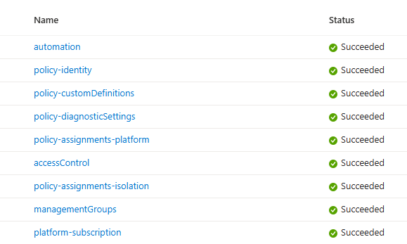

# Everything-as-Code

Some things can’t vary from one environment to another — policies, access control, landing zone setup, deployment flow. In this platform, every one of them is managed as code.

This page dives into how the code is structured — the building blocks, the Bicep modules, and the design decisions that hold the platform together.

## No Human Touch

To make that consistency real, I eliminated direct human access to production. Nobody logs into the platform to make changes by hand. Every update flows through code, reviewed and deployed via automated pipelines. That way, production stays stable, predictable, and fully reproducible.

Technically, there is an Entra ID group with Owner permissions at the top level. But that’s not a tool for daily operations — it’s a fire alarm. It exists purely for unexpected scenarios, when the platform needs human intervention to recover. In normal circumstances, it stays untouched. Daily work runs entirely through code, so the baseline never drifts and the platform remains trustworthy.

## Building Blocks

I wanted the platform to be modular. So I broke it down into building blocks: complete, independent GitHub Actions workflows, each delivering a single capability end-to-end. Think access control, policy, automation — each one is responsible for everything it needs to do its job in Azure.

Each building block owns its lifecycle. Add a block, and the capability appears in Azure — services, configuration, connections, everything. Remove it, and it’s gone with nothing left behind.

Because the building blocks are independent, you can evolve one capability without disturbing the others. If a design needs to change, you can swap out a single building block while the rest keep running untouched. That's what makes the platform both flexible and stable.


| Building Block   | Description |
|------------------|-------------|
| [**Management Groups**](/docs/platform-as-code/building-blocks/management-groups/) | Sets up the Azure Management Group hierarchy. |
| [**Access Control**](/docs/platform-as-code/building-blocks/access-control/) | Manages access control at the management group. |
| [**Automation**](/docs/platform-as-code/building-blocks/platform-automation/)   | Handles operational tasks to keep things healthy and clean. |
| [**Policy**](/docs/platform-as-code/building-blocks/azure-policy/)       | Deploys policy identities, custom policy definitions, and assigns. |
| [**Initial Landing Zone**](/docs/platform-as-code/building-blocks/initial-landing-zone/)       | Bootstraps the initial subscription, so the platform can stand up from day zero |


## Bicep Modules

Inside each building block, the real work happens in Bicep modules.
Each module is small and focused — wrapping a single Azure service or capability, like defining a policy or assigning a role.

The main Bicep file carries the hardcoded design decisions. Think of it as the blueprint: it defines how the platform should work and how it can scale. Each module is built with a clear purpose, and once the logic is set, you don’t rewrite it — you reuse it. Scaling vertically is as simple as editing a human-readable parameter file and stamping out the same design again and again.

Because modules are human-readable and self-contained, the code is easier to follow, safer to evolve, and guaranteed not to spill into parts of the system it doesn’t belong.


## Test Environments

Every change runs through a production twin — same management groups, same policies, same access control. It isn’t “close enough” or “similar.” It’s identical, end to end, just isolated in a separate subscription.

The flow is simple: every edit follows [GitHub Flow](#github-flow). A branch deploys straight into a test environment — a production-identical mirror of the platform. If it works there, it works in prod.

The main branch is locked down. The only way to production is through a Pull Request. That guarantees the exact code proven in test is what ships. Environment context comes baked into the workflows — GitHub variables inject the right values on the fly.

Need to reset? Follow a [BigBang](#big-bang)


## Code as the Source of Truth

In this platform, code decides what exists. If it’s not written down, it doesn’t live in Azure.

Azure Deployment Stacks enforce that principle. They create, update, and remove resources with `deleteAll` set by default — meaning anything not defined in code gets torn down automatically — so the environment always matches the code exactly.

A few exceptions remain. Entra ID objects, for example, can’t be fully lifecycle-managed through Deployment Stacks. For those, I fall back to classic deployments and accept the manual cleanup trade-off. It’s not ideal, but it keeps the exception visible and contained,

## Deployment Scope

The essentials of the platform — policy, access control, identity — are deployed with Azure Deployment Stacks at the top-level management group. Each stack is named after the capability it delivers, so it’s always clear what it does: one for Policy, one for Access Control, one for Automation, and so on. It’s how you trace functionality across the whole tenant.



The supporting resources (like the automation identity or monitoring workspace) live in a dedicated management subscription. Inside that subscription, they’re organized by building block, so you can see at a glance which resource belongs to which capability.

## GitHub 

### Pull Request
GitHub is the management plane for Gazelle. Every platform operation — from creating a landing zone to updating a policy — runs through a pull request. One simple mechanism covers every role and every scenario.

- Application teams open pull requests for policy exemptions or budget adjustments.
- Stakeholders review design changes.
- Platform engineers introduce new capabilities in a preview environment — a production-identical space where changes prove themselves before merging.

When a pull request opens, the test environment becomes the live demo. Changes prove themselves directly in Azure — a policy tweak, an access control reshape, a new design pattern. Review isn’t just reading code on a screen; it’s watching behavior in action. And because the whole flow is captured in GitHub, traceability comes built in.

### Github Actions

All deployments run through GitHub Actions, hosted entirely by GitHub. It’s the execution engine for the platform — every change flows through these pipelines.

Each workflow authenticates to Azure using federated Entra ID credentials scoped to `org/repo/environment`. That identity has `Owner` rights at the top-level management group, so the workflows can deploy anything the platform needs.

The service connection also carries a GitHub token with write permissions, which the workflows use for [GitHub operations like publishing variables.](/docs/getting-started/#github)


### GitHub Flow

Every change in the platform starts the same way: with an Issue. That’s the conversation starter — a place to describe what you want to change and why. From there, you spin up a short-lived branch, make the edits in code, and push.

The push goes straight into a full test environment. That’s where you validate the change by hand. If it works in test, you know it will work in prod.

Once you’re happy, the last step is simple: open a Pull Request. That PR is the only doorway into main, and merging it is what takes the exact same code you just validated and applies it to production.

```
Issue → Branch → Push → Test Environment → Validate → Pull Request

```

The loop is short, lightweight, and predictable. It keeps every change visible, reviewed, and fully aligned with the source code.

### Outputs

Some building blocks need to pass information to the next — like resource IDs or other values. To do that, they publish their outputs into GitHub variables at the moment they’re created. Downstream pipelines then read those variables as inputs.

This makes the blocks modular and decoupled: capabilities connect without manual wiring. And because communication happens only through outputs, you can redesign the internal logic of a capability without breaking the rest of the platform — as long as it provides the same service, everything downstream keeps working.

## Big Bang

The platform must always remain in a reproducible state — capable of being deployed and configured from scratch, end-to-end, using a single GitHub workflow. Every change to the platform, whether introducing a new capability or updating an existing one, is held to that principle. If you can’t destroy and rebuild cleanly, the change isn’t ready.

To validate this, two workflows are provided:

### Destroy

The workflow wipes the entire Azure platform setup. By default, it deletes all deployment stacks, clearing out the platform management subscription, management group configuration, deployment history, and child management groups. Subscriptions from those child groups are moved back under the top-level management group.

What’s left is only the initial tenant configuration, exactly as described on the Getting Started page. The workflow also purges GitHub environment variables tied to the test/prod, so the next run starts with a clean state. Repository-level variables remain untouched, since they hold global tenant-wide values that production relies on (for example, the region).

### Big Bang
A GitHub workflow that chains together every platform building block. It deploys the entire platform from scratch — management groups, policies, automation, initial landing zone -  everything. The result is a clean, fully functioning environment that can be recreated at any time, predictable and identical to the baseline defined in code.

Together, `Destroy` and `Big Bang` guarantee that the platform can always be reset, rebuilt, and trusted. The ability to deploy from nothing is the final check of truth.